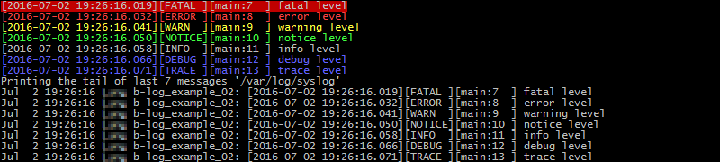
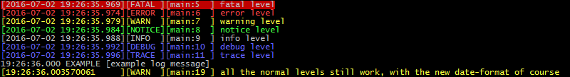

# bash logger

A library for custom logging in bash called '**[b-log](https://github.com/idelsink/b-log)**'.
Based on the idea of [log.sh](https://github.com/livibetter-backup/log.sh).

## Features

This library has the following features:

-   multiple log outputs (stdout, file, syslog)
-   multiple log levels (FATAL, ERROR, ...)
-   custom templates
-   custom error levels
-   piping of error messages

## Examples

Some small examples to show the basic usage.
For a simple complete example, see the [example.sh](./examples/example.sh) file.

### 01 Basic example

See [this](./examples/01_basic_example.sh) file.

```bash
#!/usr/bin/env bash
# example: 01 - basic example
source "$(dirname "$( realpath ${BASH_SOURCE[0]} )" )"/../b-log.sh  # include the script
LOG_LEVEL_ALL               # set log level to all
FATAL   "fatal level"
ERROR   "error level"
WARN    "warning level"
NOTICE  "notice level"
INFO    "info level"
DEBUG   "debug level"
TRACE   "trace level"
```

Terminal output:  


### 02 Log to file and syslog

See [this](./examples/02_log_to_file_and_syslog.sh) file.

```bash
#!/usr/bin/env bash
# example: 02 - log to file and syslog
source "$(dirname "$( realpath ${BASH_SOURCE[0]} )" )"/../b-log.sh  # include the script
LOG_LEVEL_ALL               # set log level to all
B_LOG --file log.txt --file-prefix-enable --file-suffix-enable
B_LOG --syslog '--tag b-log_example_02'
FATAL   "fatal level"
ERROR   "error level"
WARN    "warning level"
NOTICE  "notice level"
INFO    "info level"
DEBUG   "debug level"
TRACE   "trace level"
echo "Printing the tail of last 7 messages '/var/log/syslog'"
tail -n 7 /var/log/syslog
```

Terminal output:  


### 03 Custom template

See [this](./examples/03_custom_level_and_template.sh) file.

```bash
#!/usr/bin/env bash
# example: 03 - custom log level and template
source "$(dirname "$( realpath ${BASH_SOURCE[0]} )" )"/../b-log.sh  # include the script
LOG_LEVEL_ALL               # set log level to all
FATAL   "fatal level"
ERROR   "error level"
WARN    "warning level"
NOTICE  "notice level"
INFO    "info level"
DEBUG   "debug level"
TRACE   "trace level"
# add new log level with the following:
# level nr: 50
# level name: EXAMPLE
# template: timestamp(only time) name [message]
B_LOG --date-format "%H:%M:%S.%N" # set timestamp format
LOG_LEVELS+=("50" "EXAMPLE" "@12:1@ @2@ [@5@]" "\e[37m" "\e[0m") # add custom log level
B_LOG_MESSAGE 50 "example log message"
WARN "all the normal levels still work, with the new date-format of course"
```

Terminal output:  


## Usage

### Include in script

```bash
# relative include b-log from file
source "$(dirname "$( realpath ${BASH_SOURCE[0]} )" )"/<relative path to b-log>/b-log.sh
```

### Parameters

The `B_LOG` function, acts like the script interface.
From here all the parameters can be set.

```text
Example of
b-log v1.2.0

Usage: B_LOG [options]
  -h, --help              Show usage
  -V, --version           Version
  -d, --date-format       Date format used in the log eg. '%Y-%m-%d %H:%M:%S.%N'
  -o, --stdout            Log over stdout (true/false) default true.
  -f, --file              File to log to, none set means disabled
  --file-prefix-enable    Enable the prefix for the log file
  --file-prefix-disable   Disable the prefix for the log file
  --file-suffix-enable    Enable the suffix for the log file
  --file-suffix-disable   Disable the suffix for the log file
  -s, --syslog            'switches you want to use'. None set means disabled
                          results in: "logger 'switches' log-message"
  -l, --log-level         The log level
                          Log levels       : value
                          ---------------- : -----
                          LOG_LEVEL_OFF    : 0
                          LOG_LEVEL_FATAL  : 100
                          LOG_LEVEL_ERROR  : 200
                          LOG_LEVEL_WARN   : 300
                          LOG_LEVEL_NOTICE : 400
                          LOG_LEVEL_INFO   : 500
                          LOG_LEVEL_DEBUG  : 600
                          LOG_LEVEL_TRACE  : 700
```

#### Log level

Setting the log level can be accomplished in three different ways.  
First via a simple integer value, second via the available parameters
and last via a function.

```bash
# Log level OFF
B_LOG --log-level 0
# Log level FATAL
B_LOG --log-level $LOG_LEVEL_FATAL
# Log level ERROR
LOG_LEVEL_ERROR # Internal call to B_LOG --log-level $LOG_LEVEL_ERROR
```

#### Logging

Logging can be done via two ways.  
First there are the predefined functions:

```bash
FATAL "fatal level"
ERROR "error level"
WARN "warning level"
INFO "info level"
DEBUG "debug level"
TRACE "trace level"
```

Second the underlying generic functions that is called:

```bash
B_LOG_MESSAGE error_level "message"     # error_level is the integer value
B_LOG_MESSAGE LOG_LEVEL_INFO "message"  # send message to INFO
B_LOG_MESSAGE 400 "message"             # 400 is the value of LOG_LEVEL_INFO
```

The `B_LOG_MESSAGE` function, which is used to log messages,
can also read from stdin.  
For example:

```bash
echo "piped into INFO" | INFO
echo "piped into INFO" | B_LOG_MESSAGE $LOG_LEVEL_INFO
echo "piped into INFO" | B_LOG_MESSAGE 400
```

#### Logging via stdout

Stdout is the standard output used. by default this is enabled.
To enable or disable this use the following commands:

```bash
B_LOG --stdout true # enable logging over stdout
B_LOG --stdout false # disable logging over stdout
```

#### Logging via a file

By default, logging to a file is disabled.
To enable this, use the following commands:

```bash
B_LOG --file log/log.txt # logs to a file called log.txt
# enable the prefix and suffix, these contain the color formats
B_LOG --file-prefix-enable --file-suffix-enable
```

#### Logging via the syslog

Logging via the linux `logger` command can be handy in some cases.
To enable, use the following:

```bash
# this will log all the messages to the '/var/log/syslog' with tag 'b-log'
# for all the parameters available see the man page of logger. 'man logger'
B_LOG --syslog '--tag b-log'
```

As demonstrated the underlying code will simply call the `logger` command with
the settings as the parameters to the command.  
Eg. `logger parameters log-message`.

### Templates

The log templates are base on a string in the `LOG_LEVELS` array.

Templates are based on numbers between the special character `@`.
This can be done in two formats:

-   `@s@`
-   `@l:s@`

`s` is the selector to select the type in the list below.
`l` is the length of the string of the selected item.
If this is not set, the length that is needed for the string is used.

The following parameters are supported at this moment:

1.  time-stamp (this uses the date-format that can be customized via the `--date-format` parameter)
2.  log level name
3.  function name
4.  line number
5.  log message
6.  space character
7.  filename

The default template used, that is stored in `B_LOG_DEFAULT_TEMPLATE`, is:  
`[@23:1@][@5:2@][@3@:@3:4@] @5@`

The items used in this template are:

-   timestamp, size 23
-   log level name, size 5
-   function name, no limit
-   line number, size 3
-   log message, no limit

The output would be (taken from [example 01](./examples/01_basic_example.sh)):

```text
[2016-07-02 18:46:02.005][INFO ][main:8  ] info level
```

### Custom log levels

Besides the default log levels, custom levels can be added.
All log levels are stored in an array with the following layout:

-   log level integer value (eg. value 400 for INFO)
-   log level name (eg. INFO)
-   log level template (eg. `[@23:1@][@5:2@][@3@:@3:4@] @5@` as default)
-   log level prefix (something before the log message. eg. color codes)
-   log level suffix (something after the log message. eg. color codes)

To add a log level, do the following:

```bash
# add level with number 50, name EXAMPLE, default template and colors like WARN
LOG_LEVELS+=("50" "EXAMPLE" "[@23:1@][@5:2@][@3@:@3:4@] @5@" "\e[37m" "\e[0m")
# or
LOG_LEVELS+=("50" "EXAMPLE" "$B_LOG_DEFAULT_TEMPLATE" "\e[37m" "\e[0m")
```

See also [this](./examples/03_custom_level_and_template.sh) example file.

## License

> You can check out the full license [here](./LICENSE)

This project is licensed under the terms of the **MIT** license.
